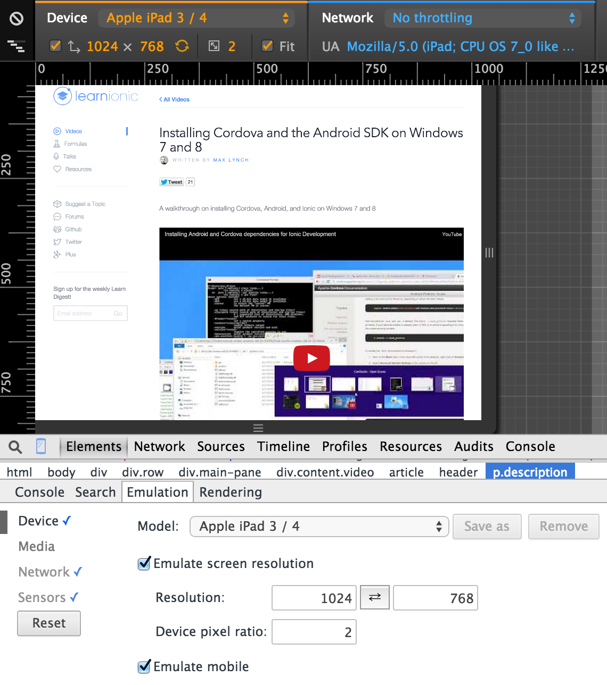
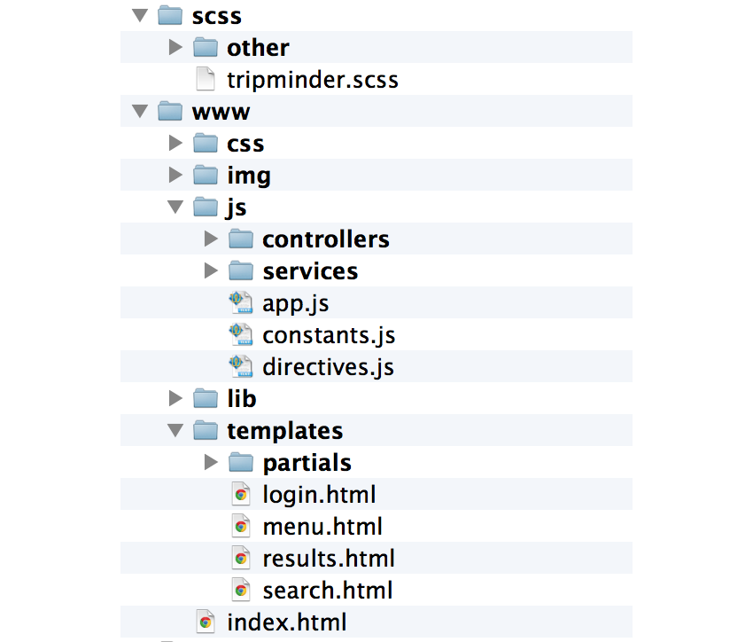

# Trip Minder (on Ionic Framework)

Here I'll write down everything I learn step by step during the development of TripMinder using Ionic Framework.

## Index

- [1. Introduction to Ionic Framework](#1-introduction-to-ionic-framework) 
- [2. Log book](#2-log-book) 
- [3. Issues](#3-issues) 


## 1. Introduction

Ionic Framework let's you develop multiplatforms hybrid app's using the most powerful tools used in frontend web development.

It consists of: 
- **Apache Cordova**: used as the API to connect to the devices. It provides compilation tools, lots of plugins and direct access to sensors and components of the device.
- **AngularJS**: the most powerful front-end framework. Only say that, when are used to code in AngularJS, you cannot live without it.
- **SASS**: popular preprocessor for css. You can use vars and mixings with it.
- **Ionic-cli**: set of terminal commands that combine the power of Gulp, Bower and Cordova in orden to unify the command-line orders.
- **And more!!**: ionic also provides its own angular directives, sass template and more utils to make your life easier!


## 2. Log book

Here I describe what I'm doing everyday as a log book.

###Day 01: Installation, build and first run in Android and iOS

Install all the packages required:
```
npm install -g cordova ionic bower
```

Create an app (Instead of *sidemenu*, it's available *blank* or *tabs*)
```
ionic start TripMinder sidemenu
```

At this point, I have a sample sidemenu app created. I want to add SASS, so now:
```
ionic setup sass
```

#####Build & Run on iOS
You need a Mac (currently, on January 2015) to do so. It's needed ios-sim to run it on a simulator:
```
npm install -g ios-sim
```
Now, you can emulate the app (first add the platform):
```
ionic platform add ios
ionic emulate ios
```

#####Build & Run on Android
For Android is a little bit more complicated. In all platforms the end goal is to have installed and linked to the PATH the Android SDK (with API 19 and *build tools* >= 19.1), Java and Ant.


On Windows, follow [this official tutorial](http://learn.ionicframework.com/videos/windows-android/)

On Mac Os X, install **ant**:
```
brew install ant
```
Download and install the Android SDK. Now, install API 19 and a version greater than 19.1 of the build-tools.

After that, it must be in the PATH:
```
/** The next example is in my case, you write your path **/

export ANDROID_HOME="/Applications/android-sdk-macosx/"
export ANDROID_TOOLS="/Applications/android-sdk-macosx/tools/"
export ANDROID_PLATFORM_TOOLS="/Applications/android-sdk-macosx/platform-tools/"
PATH=$PATH:$ANDROID_HOME:$ANDROID_TOOLS:$ANDROID_PLATFORM_TOOLS
```

Now you can add (`ionic platform add android`) and emulate the app. Since the Android emulators are very slow, I'm using a device, and I only have to plug and run it:
```
ionic run android
```

### Day 02: Development workflow

I've described in Day 01 how to lunch the app in Android and iOS, but the best way to test it is using **Chrome**. In there you can run it and see the changes in *"live mode"*, by using Live Reload:
```
// start a server on port 9999 and livereload port 9998

ionic serve 9999 9998 
```
Chrome has its own emulation tool, and work very well!




### Day 03: Let's develop! First view, template & controller

First of all, I'll perform a lot of API calls, and *Angular resources* are perfect for that (is not installed by default), and I want them to be cancelable. Also I want to show loading progress during these calls. 

In order to cope with that, I've installed:

- **Angular resources**: `bower install angular-resource`
- **Angular abortable requests**: `bower install angular-abortable-requests`
- **Angular loading bar**: `bower install angular-loading-bar`

*Wether you use `bower`, some libraries path are changed, you'll have to change them within `index.html`. It's better to use `ionic [add | remove] <package>`, but it doesn't work for me so I did it that way.*


The next is step (as always) is to include them into `app.js` and `index.html`. I've also changed the *Angular loading bar* style, so I've put the `css` code into a `.scss` vendor file (I'll talk about it).


#### Adding a view

To add a view, it must be done in the next 3 steps:

- Create a `.html` Template
- Create a Controller (optional)
- Create a state and reference them in the UI-Route code (in `app.js`)

First things first, I've created the view and added the next tags:
```html
<ion-view view-title="Buscar rutas">
  <ion-content class="padding-vertical"> 
  	 ...
  </ion-content>
</ion-view>
```

In the inner content of these tags, let's write 2 inputs clearables (look at `tm-item-clickeable` attribute on the `<input>` tag):
```html
<label class="item item-input item-stacked-label">
	<span class="input-label">Origen</span>
	<div class="input-wrap"> 
	    <input tm-reset-field type="text" placeholder="Ej: Murcia..." ng-model="inputs.origin" ng-change="GetData(inputs.origin)">
	</div>
</label>
```

Ionic framework provide us with so many clases for designing layouts and ui-components, just read the [documentation](http://ionicframework.com/docs/).

Now, I've added the controller and the state, as you can see in it's respective files.

### Day 04: Structuring the app

Organization is the best development practice. It makes the code more reusable, easy to understand and maintainable. So I've structured the `.js` in that way:




### Day 05: Making requests 

First of all, I've added a list and linked to the scope in order to insert the Google Autocomplete API results:
```html
<ul class="list">
	<li class="item tm-item-clickeable" ng-repeat="place in origins" 
	    ng-click="SelectOrigin($index)">{{ place.description }}</li>
</ul>
```

Also, in `services/restSvc.js` I've created 2 services (or angularjs factories):

- **ResourcesSvc**: it creates and control the $resources cancelable.
- **RestSvc**: uses the ResourcesSvc to make more complex calls.

*RestSvc* also uses $ionicLoading to show a modal message about the progress of the calls.

So, to make the Search call, it works the following way:

- The controller calls RestSvc.Search()*
- *RestSvc* uses the *ResourcesSvc* to do the call. Also manage some other variables for showing call states in $ionicLoading layout. 
- When it finishes, *RestSvc* send the data to *DataSvc*, which is in charge of store the data.


### Day 06: Install ngCordova and Implement Google Maps

**ngCordova** is a library that wraps Cordova plugins into AngularJS services. It's made by Ionic team, and currently has 63 plugins (February, 2015).

I'm going to implement google maps, so it would be useful to use the [Cordova Geolocation plugin](https://github.com/apache/cordova-plugin-geolocation/blob/master/doc/index.md).

First, I've installed ngCordova following the steps of the [official documentation](http://ngcordova.com/docs/install/). After that, installed the Geolocation plugin:
```
ionic plugin add org.apache.cordova.geolocation
```

Now, let's cope with Google Maps! As usually, there is a great AngularJS library for Google Maps. Follow the [installation guide](http://angular-ui.github.io/angular-google-maps/#!/use).


## 3. Issues

#### 01. Ionicons and its names
When you create a ionic project using the cli command line `ionic start projectname type`, an older versión of ***ionicons*** is installed. 

To update them, download them and place them on its `www/lib/...` *scss* and *fonts* folder. (Don't do it, since ionic still depends on 1.5.x (on January 2015)

If you're using the version 1.5.x of Ionicons, **ion-ios-...** prefix is **ion-ios7-...** instead.

**Important note: if you're using Ionicons 2.X, you need to change** `ion-ios-arrow-back` **for** `ion-ios-arrow-back` **within** `www/lib/js/ionic.bundle.js`


#### 02. Google Maps integration 
Using Ionic (v 1.0.0-beta14, on February 2015), there is an issue with the events of Google Maps Javascript API v3. The **click, mousedown and mouseup** don't work well. They work only if you don't fire any event for 5 seconds, and you do it.

The only workaround I've found is using the **dblclick** event instead, and disabling the **disableDoubleClickZoom** property.

I was using it to add a Marker on click.


**See links:** [Forum thread](http://forum.ionicframework.com/t/click-not-detected-on-google-map-even-using-data-tap-disabled-true/3922) , [Issue](https://github.com/driftyco/ionic/issues/2614)


