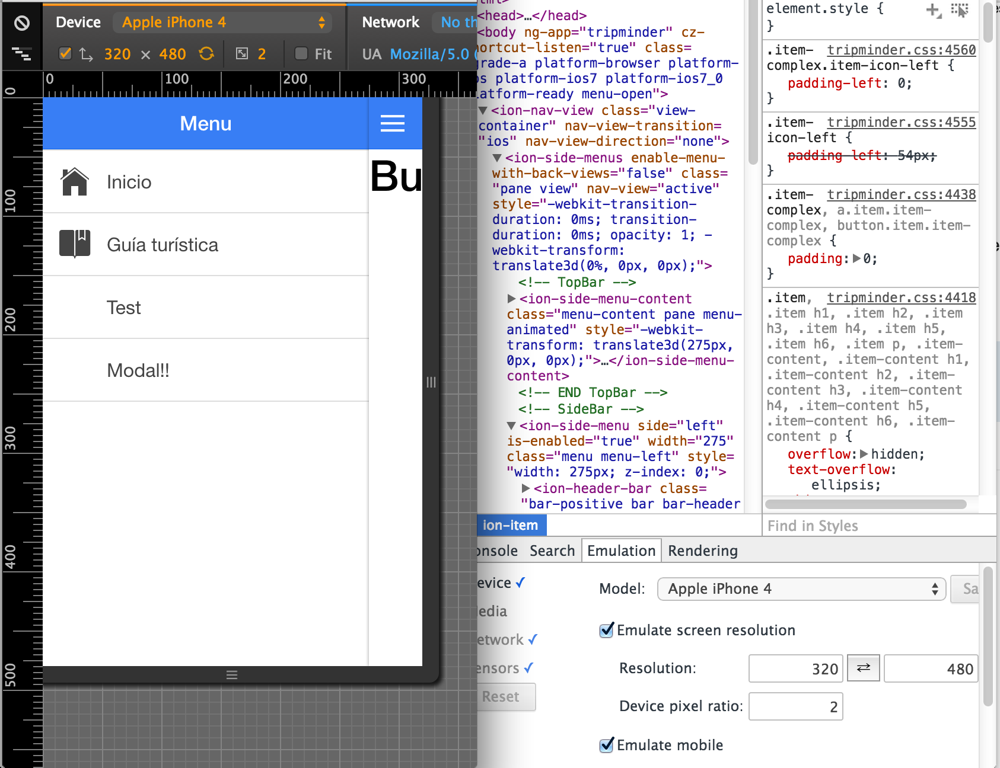

# Trip Minder (on Ionic Framework)

Here I'll write down everything I learn step by step during the development of TripMinder using Ionic Framework.

## Index

- [1. Introduction to Ionic Framework](#1-introduction-to-ionic-framework) 
- [2. Log book](#2-log-book) 
- [3. Issues](#3-issues) 


## 1. Introduction

Ionic Framework let's you develop multiplatforms hybrid app's using the most powerful tools used in frontend web development.

It consists of: 
- **Apache Cordova**: used as the API to connect to the devices. It provides compilation tools, lots of plugins and direct access to sensors and components of the device.
- **AngularJS**: the most powerful front-end framework. Only say that, when are used to code in AngularJS, you cannot live without it.
- **SASS**: popular preprocessor for css. You can use vars and mixings with it.
- **Ionic-cli**: set of terminal commands that combine the power of Gulp, Bower and Cordova in orden to unify the command-line orders.
- **And more!!**: ionic also provides its own angular directives, sass template and more utils to make your life easier!


## 2. Log book

Here I describe what I'm doing everyday as a log book.

###Day 01: Installation, build and first run in Android and iOS

Install all the packages required:
```
npm install -g cordova ionic bower
```

Create an app (Instead of *sidemenu*, it's available *blank* or *tabs*)
```
ionic start TripMinder sidemenu
```

At this point, I have a sample sidemenu app created. I want to add SASS, so now:
```
ionic setup sass
```

#####Build & Run on iOS
You need a Mac (currently, on January 2015) to do so. It's needed ios-sim to run it on a simulator:
```
npm install -g ios-sim
```
Now, you can emulate the app (first add the platform):
```
ionic platform add ios
ionic emulate ios
```

#####Build & Run on Android
For Android is a little bit more complicated. In all platforms the end goal is to have installed and linked to the PATH the Android SDK (with API 19 and *build tools* >= 19.1), Java and Ant.


On Windows, follow [this official tutorial](http://learn.ionicframework.com/videos/windows-android/)

On Mac Os X, install **ant**:
```
brew install ant
```
Download and install the Android SDK. Now, install API 19 and a version greater than 19.1 of the build-tools.

After that, it must be in the PATH:
```
export ANDROID_HOME="/Users/<user_name>/Library/Android/sdk"
export ANDROID_TOOLS="/Users/<user_name>/Library/Android/sdk/tools/"
export ANDROID_PLATFORM_TOOLS="/Users/<user_name>/Library/Android/sdk/platform-tools/"
PATH=$PATH:$ANDROID_HOME:$ANDROID_TOOLS:$ANDROID_PLATFORM_TOOLS
```

Now you can add (`ionic platform add android`) and emulate the app. Since the Android emulators are very slow, I'm using a device, and I only have to plug and run it:
```
ionic run android
```

### Day 02: Development workflow

I've described in Day 01 how to lunch the app in Android and iOS, but the best way to test it is using **Chrome**. In there you can run it and see the changes in *"live mode"*, by using Live Reload:
```
ionic serve // start a server
ionic watch // update on changes
```
Chrome has its own emulation tool, and work very well!




## 3. Issues

#### 01. Ionicons and its names
When you create a ionic project using the cli command line `ionic start projectname type`, an older versión of ***ionicons*** is installed. 

To update them, download them and place them on its `www/lib/...` *scss* and *fonts* folder.

If you're using the version 1.5.x of Ionicons, **ion-ios-...** prefix is **ion-ios7-...** instead.

