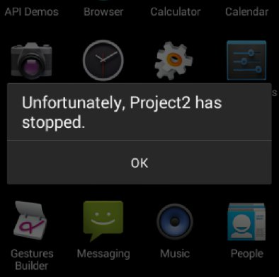
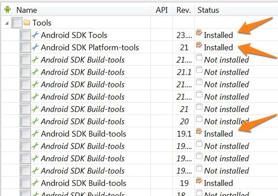
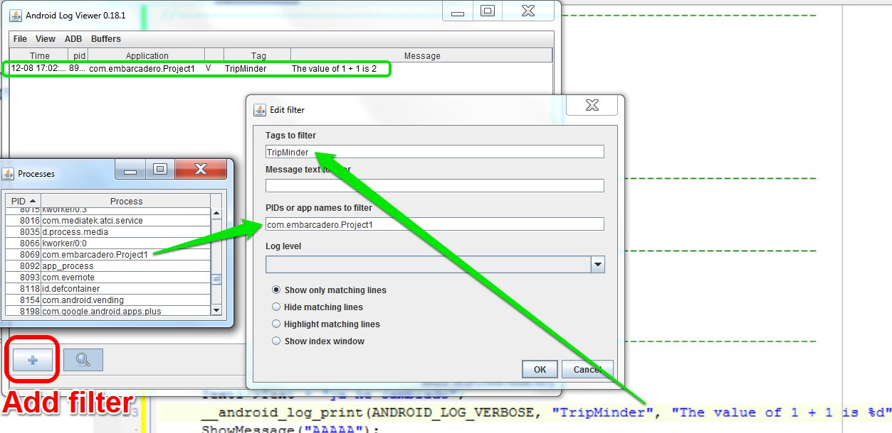

# RAD STUDIO XE6 C++

In order to gather together some tips that I'm learning on the way coding with RAD STUDIO XE6 C++ version, I create this documentation. It includes the problems which I run into, and their respective solution I find out.

## Index

- [1. App crashes on Android devices](#1-app-crashes-on-android-devices) 
- [2. How to debug on Android devices](#2-how-to-debug-on-android-devices) 
- [3. Bindings on RAD Studio and REST API's](#3-bindings-on-rad-studio-and-rest-apis) 


## 1. App crashes on Android devices
Somehow, with RAD Studio XE6 C++, in my case (the same for others friends) when deploying the app to an Android device it crashes. 



To solve that, first you must update the sdk and the build tools. To do that, open the Android Tools of RAD Studio, and install/update them:



Next, update in RAD Studio the path to **zipalign.exe**. To do so, in RAD Studio, go to *Tools > Options > SDK Manager* and you'll see and exclamation. The path should be in a similar path to the next:
```
C:\Users\Public\Documents\Embarcadero\Studio\14.0\PlatformSDKs\adt-bundle-windows-x86-20131030\sdk\build-tools\19.1.0\zipalign.exe
```
Then you'll be able to deploy it well-working.

## 2. How to debug on Android devices

You can accomplish that with the next 3 ways:

### 2.1. Breakpoints
You can insert breakpoints, but this is a little hard to understand and not useful when you want to know some kick property like `TText1->Text`. 

### 2.2. Alert
Simple usage and multidevice, but very limited. Just call the next function:
```c++
ShowMessage("some text");
```

### 2.3. Logging system (for Android)
The best solution for me is this one. You can do it following these steps:
  - Include `#include <android/log.h>` in your code.
  - Use the function `__android_log_print(ANDROID_LOG_VERBOSE, "AppName", "Custom %s", text);`. Note that you can use `%s`, `%d` and so on.
  - You need a program to catch the message. I use [Log Viewer](https://bitbucket.org/mlopatkin/android-log-viewer/downloads) which is simple. Download it, extract the contents and run `logview.bat`. When it is launched, you must tell where the `adb.exe` path is. It should be similar to `C:\Users\Public\Documents\Embarcadero\Studio\14.0\PlatformSDKs\adt-bundle-windows-x86-20131030\sdk\platform-tools\adb.exe`
  - To filter the messages, you can do it by the tag that you provide in the code ("TripMinder" in my case) and with the process name (you can see it in _View > Show processes_)
  
  

**Important note:** if you want to use the function `__android_log_print(...)` using the `%s` alias in the last parameter, it expects that as a `char*`, but RAD Studio uses the `String` or `System::UnicodeString`. To do the conversion:
```c++
	String text = "Hello world";
	char *txt = AnsiString(text).c_str();
```


## 3. Bindings on RAD Studio and REST API's

I've found out the Bindings in RAD Studio, and the REST Components. You can perform a REST Service call just using:

- **RESTClient:** filling the base_url property (*https://maps.googleapis.com/maps/api/place/autocomplete/json*, in my case).
- **RESTRequest:** telling which Client and Response to use. Here you'll add some params. I use *key*, *types* and *input*. The first two are static, so I added the value in the designer. But the *input* param has to get the value from a Edit. In order to do that, just link the *TEdit.Text* to the *RESTRequest.Param.input*, in the LiveBindings Designer. 
- **RESTResponse:** binding the Content to a TMemo (for testing)

And then, just place the code `RESTRequest1->Execute()` wherever you want (in a OnChange edit event, for instance), and all the work is done.

#### Issues

**First issue**: I don't want a TMemo displaying the result. I want a BoxList showing the description property of the json array response.

For that, you must add both *RESTResponseDataSetAdapter* and *DataSet* to the form.
 
- Now, tell the *RESTResponseDataSetAdapter* to use the *Dataset* you've created. 
- Then, right-click on the RESTRequest and select "Execute". Now it's shown the fields in the *Dataset FieldDefs* property.
- Add whichever field you want to Fields

Here, It shows up a *BindSourceDB* object in the LiveBindings Designer, which contains the fields of the Dataset. So I created the Listbox in question and binded the field "description" to the Listbox.Item.Text.


**Second issue**: The `RESTRequest1->Execute()` stop the interaction for some seconds. To cope with that, it must be used `RESTRequest1->ExecuteAsync()`, but now I want to do something when it finishes and I want two of them (one for the origin and another for the destination). So the code is:

    if(aux == ClearingEdit1){
		originThread = RESTRequest1->ExecuteAsync();
		originThread->OnTerminate = OriginThreadTerminated;
	}
	else{
		destinationThread = RESTRequest1->ExecuteAsync();
		destinationThread->OnTerminate = DestinationThreadTerminated;
	}

*originThread* and *destinationThread* are `TRESTExecutionThread*` typed, and for the callbacks, declare them as `void __fastcall OriginThreadTerminated(TObject *Sender);`


**Third issue**: the TEdit binding to the RESTRequest input param wasn't working well. I broke up the binding and add the next code manually, before performing the `RESTRequest1->ExecuteAsync();` call:

    RESTRequest1->Params->ParameterByName("input")->Value = aux->Text;


## 4. Other strange errors

**Invalid floating pointer**: I've got this only on Android platform. It was something related to the float numbers in the `.fmx` file. I've solved rounding these floats numbers.