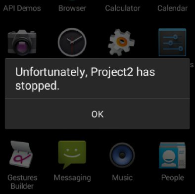
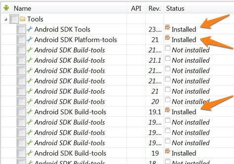
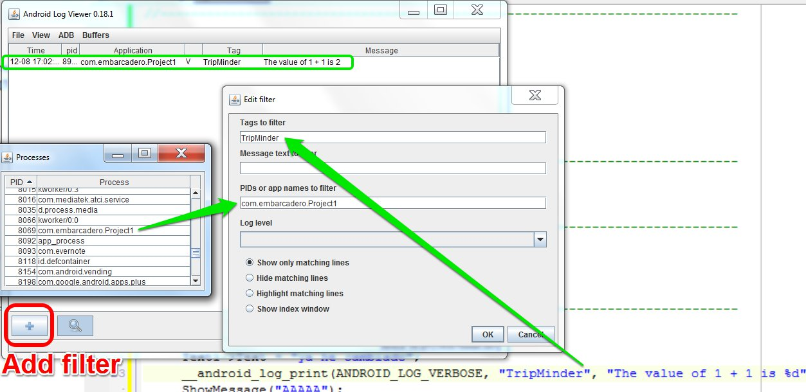

# RAD STUDIO XE6 C++

In order to gather together some tips that I'm learning on the way coding with RAD STUDIO XE6 C++ version, I create this documentation. It includes the problems which I run into, and their respective solution I find out.

## 1. App crashes on Android devices
Somehow, with RAD Studio XE6 C++, in my case (the same for others friends) when deploying the app to an Android device it crashes. 



To solve that, first you must update the sdk and the build tools. To do that, open the Android Tools of RAD Studio, and install/update them:



Next, update in RAD Studio the path to **zipalign.exe**. To do so, in RAD Studio, go to *Tools > Options > SDK Manager* and you'll see and exclamation. The path should be in a similar path to the next:
```
C:\Users\Public\Documents\Embarcadero\Studio\14.0\PlatformSDKs\adt-bundle-windows-x86-20131030\sdk\build-tools\19.1.0\zipalign.exe
```
Then you'll be able to deploy it well-working.

## 2. How to debug on Android devices

You can accomplish that with the next 3 ways:

### 2.1. Breakpoints
You can insert breakpoints, but this is a little hard to understand and not useful when you want to know some kick property like `TText1->Text`. 

### 2.2. Alert
Simple usage and multidevice, but very limited. Just call the next function:
```java
ShowMessage("some text");
```

### 2.3. Logging system (for Android)
The best solution for me is this one. You can do it following these steps:
  - Include `#include <android/log.h>` in your code.
  - Use the function `__android_log_print(ANDROID_LOG_VERBOSE, "AppName", "Custom %s", text);`. Note that you can use `%s`, `%d` and so on.
  - You need a program to catch the message. I use [Log Viewer](https://bitbucket.org/mlopatkin/android-log-viewer/downloads) which is simple. Download it, extract the contents and run `logview.bat`. When it is launched, you must tell where the `adb.exe` path is. It should be similar to `C:\Users\Public\Documents\Embarcadero\Studio\14.0\PlatformSDKs\adt-bundle-windows-x86-20131030\sdk\platform-tools\adb.exe`
  - To filter the messages, you can do it by the tag that you provide in the code ("TripMinder" in my case) and with the process name (you can see it in _View > Show processes_)
  
  

**Important note:** if you want to use the function `__android_log_print(...)` using the `%s` alias in the last parameter, it expects that as a `char*`, but RAD Studio uses the `String` or `System::UnicodeString`. To do the conversion:
```c++
	String text = "Hello world";
	char *txt = AnsiString(text).c_str();
```


